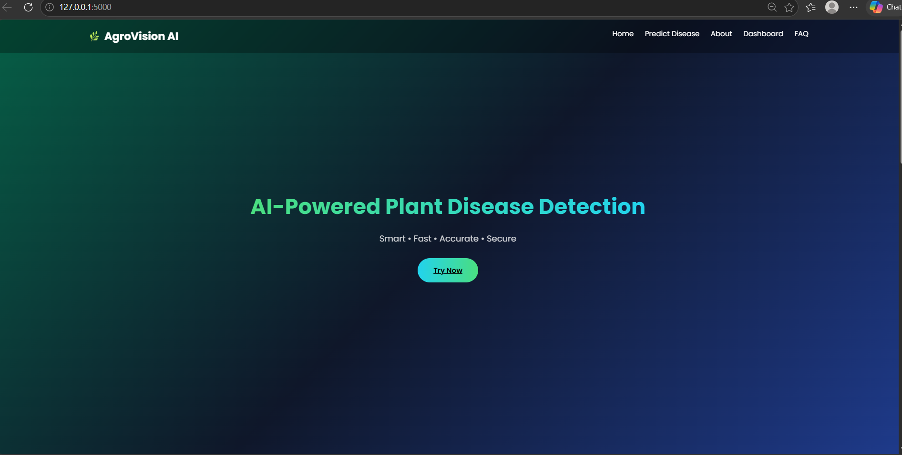
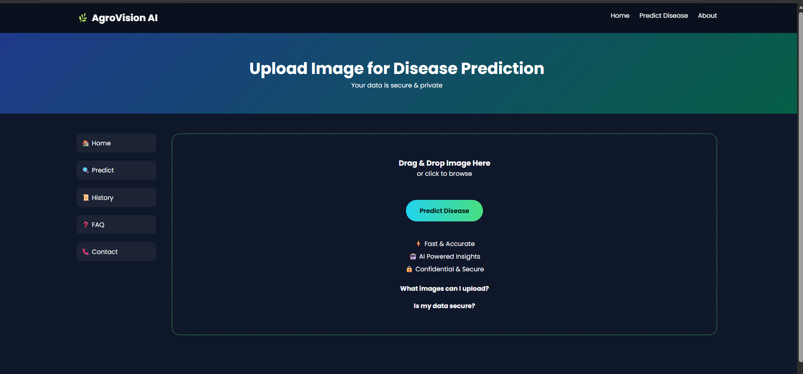
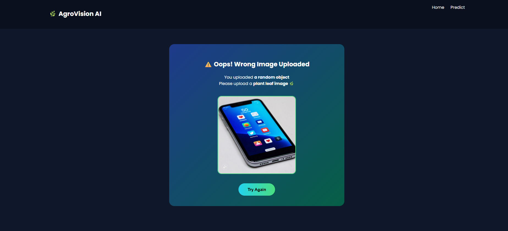
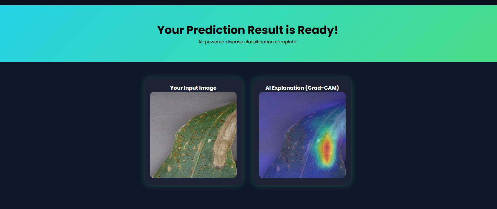
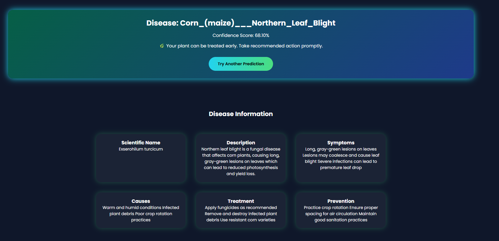

# 🌿 AI-Based Plant Disease Detection using Deep Learning


AI-powered Plant Disease Detection Web Application using **EfficientNetB0, Flask, Grad-CAM, and CLIP-based Image Validation**.

---

# 📸 DEMO Images Preview

## 🏠 Home Page


---

## 🔍 Prediction Page



## 📊 Error Page


---

## 📊 Result Page



## 📊 Information Page


---


---

---


# 🚀 Project Overview

This project is a deep learning-based web application that detects plant diseases from leaf images using a fine-tuned **EfficientNetB0** model.

The system allows users to:

- Upload plant leaf images
- Detect plant diseases in real time
- View confidence percentage
- Generate Grad-CAM heatmaps for explainability
- Compare original and heatmap images
- Validate uploaded images using CLIP
- Use a responsive Flask-based web interface

This project is designed with a production-level architecture suitable for:
- AI/ML portfolios
- Resume projects
- Research understanding
- Real-world deployment concepts

---


# 🛠️ Tech Stack

## Machine Learning & Deep Learning
- TensorFlow
- Keras
- EfficientNetB0
- Transfer Learning
- Fine-Tuning
- Grad-CAM
- OpenAI CLIP Model

## Backend
- Flask
- REST API

## Frontend
- HTML5
- CSS3
- JavaScript

## Tools & Environment
- VS Code
- Jupyter Notebook
- Git & GitHub
- Anaconda

---

# 📂 Dataset Details

- Multi-class plant disease dataset
- Organized into train/test folders
- Images resized to `224x224`
- Class-wise folder structure

Example:

```bash
dataset/
│
├── train/
│   ├── Tomato___healthy
│   ├── Tomato___Early_blight
│   ├── Potato___Late_blight
│   └── ...
│
└── test/
    ├── Tomato___healthy
    ├── Tomato___Early_blight
    └── ...
```

---

# 🧠 Model Architecture

## Base Model
- EfficientNetB0
- Pre-trained on ImageNet
- `include_top=False`
- Input Shape: `(224, 224, 3)`

## Custom Layers
- GlobalAveragePooling2D
- Dropout
- Dense Layer (ReLU)
- Softmax Output Layer

---

# 📈 Training Strategy

## Phase 1 — Feature Extraction
- Freeze EfficientNetB0 layers
- Train custom classification head
- Learning Rate: `1e-3`

## Phase 2 — Fine-Tuning
- Unfreeze top layers
- Lower Learning Rate: `1e-5`
- EarlyStopping
- Data Augmentation
- Regularization
- Validation Monitoring

---

# 🔥 Grad-CAM Visualization

Grad-CAM is used to visualize the regions responsible for model predictions.

## Features
- Heatmap generation
- Visual explanation of predictions
- Better transparency and trustworthiness

Workflow:
1. Extract final convolutional layer
2. Compute gradients
3. Generate activation heatmap
4. Overlay heatmap on original image

---

# 🧠 CLIP-Based Invalid Image Detection

The system integrates a CLIP-based validation mechanism to detect invalid or unrelated image uploads before prediction.

## Purpose
Prevents users from uploading:
- Non-plant images
- Random objects
- Blurry or unsupported images
- Irrelevant content

## Workflow
1. User uploads image
2. CLIP validates image relevance
3. If plant-related:
   - Continue prediction
4. Otherwise:
   - Return validation error

## Benefits
✅ Improves prediction reliability  
✅ Reduces false predictions  
✅ Enhances user experience  
✅ Adds intelligent validation layer  

---

# ⚙️ Inference Pipeline

## Workflow
1. User uploads image
2. Flask backend receives image
3. Image preprocessing:
   - Resize to 224x224
   - Normalize
   - Convert to array
4. CLIP validates image
5. EfficientNetB0 predicts disease
6. Confidence score calculated
7. Grad-CAM generated
8. Results returned to frontend

---

# 🧩 Class Mapping

Class labels are managed using `config.py`.

Example:

```python
CLASS_NAMES = {
    0: "Tomato___healthy",
    1: "Tomato___Early_blight",
    2: "Potato___Late_blight"
}
```

---

# ⚙️ Flask Backend

## Routes

| Route | Description |
|------|-------------|
| `/` | Home Page |
| `/predict` | Disease Prediction API |

## Backend Responsibilities
- Model loading
- Image preprocessing
- Prediction pipeline
- Grad-CAM generation
- CLIP validation
- JSON response handling

---

# 🎨 Frontend Features

- Image upload preview
- Loading animation
- Real-time prediction result
- Confidence percentage
- Grad-CAM visualization
- Responsive web design

---

# 📁 Project Structure

```bash
Plant-Disease-Detection/
│
├── app/
│   ├── static/
│   ├── templates/
│   └── app.py
│
├── src/
│   ├── config.py
│   ├── gradcam.py
│   ├── predict.py
│   ├── train_ENB0.py
│   ├── train_RN50.py
│   └── evaluate.py
│
├── notebooks/
├── requirements.txt
├── README.md
└── .gitignore
```

---

# ✨ Key Features

✅ Multi-class plant disease detection  
✅ Transfer Learning with EfficientNetB0  
✅ Fine-tuned deep learning model  
✅ CLIP-based image validation  
✅ Grad-CAM explainability  
✅ Flask web application  
✅ Real-time prediction system  
✅ Production-style project structure  

---

# 📊 Performance Metrics

- Training Accuracy
- Validation Accuracy
- Loss Curves
- Classification Report
- Confusion Matrix

---

# ▶️ Run Locally

## Clone Repository

```bash
git clone https://github.com/yourusername/Plant-Disease-Detection.git
```

## Install Requirements

```bash
pip install -r requirements.txt
```

## Run Flask App

```bash
python app/app.py
```

---

# ⚠️ Note

- Dataset and trained model weights are not included due to GitHub size limitations.
- Model weights are available upon request.

---

# 👨‍💻 Author

**Prasad Joshi**  
AI/ML Enthusiast | Deep Learning | Generative AI
